# @qa-guru/allure-report-kit

DX kit for **Allure Report 3**: a theme, pluggable chart renderers, custom
panels with bar indicators, DS quality-gate tiles, and a real design-system
header on top of the report.

> v0.2 — works inside a real generated Allure 3 report. See `soft-fork/README.md`.

## Gallery

Screens from the e2e fixture (`npm run verify:report` → stands `ark-report`
:3024 and `ark-dogfood` :3021).

### Awesome vs Dashboard

Same kit layout leads both surfaces — locked 2×2, then Allure + Sonar quality
gates.

<table>
<tr>
<td width="50%" valign="top">

**Awesome** — Charts tab

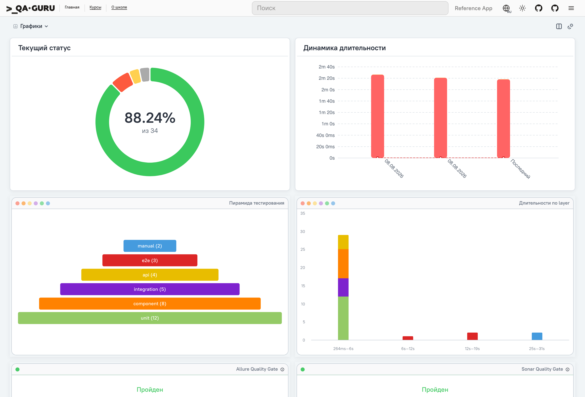

</td>
<td width="50%" valign="top">

**Dashboard** — full layout

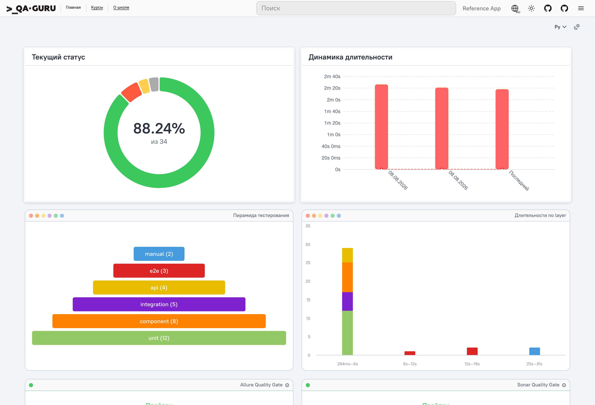

</td>
</tr>
</table>

### Stock Allure vs kit

Same locked 2×2 row: upstream nivo on the left pair, kit soft-fork on the right
(SVG pyramid + Highcharts durations, DS `widget-tile` chrome and status dots).

<table>
<tr>
<td width="50%" valign="top">

**Stock Allure** — `currentStatus` + `durationDynamics` (nivo)

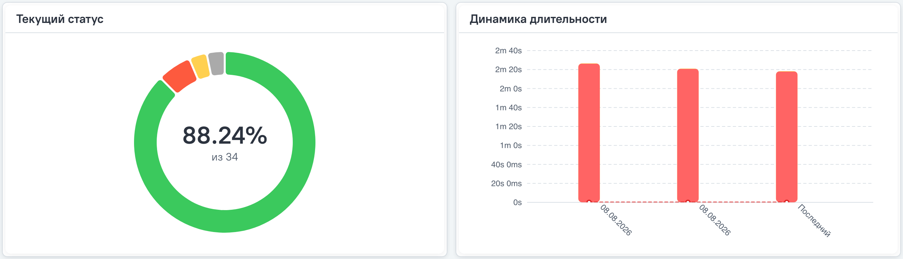

</td>
<td width="50%" valign="top">

**With kit** — `testingPyramid` (svg) + `durations` (highcharts)

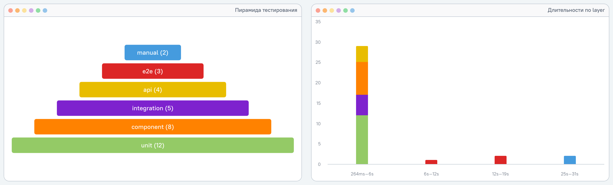

</td>
</tr>
</table>

### Quality gates — Allure + Sonar

`panels.qualityGate()` (verdict from the run) and a Sonar tile (`kind: "sonar"`,
DS primitive, info popover). Same chrome as neighbouring widgets
(`--wt-bar-inset` canon).

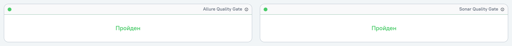

Dark theme:

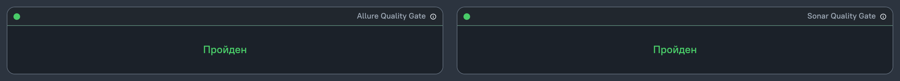

### Custom, fromRun, fromHistory

DS header, services donut + pass-rate gauge, layer table, flaky bar, pass-rate
trend.

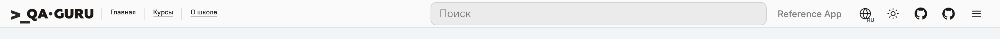

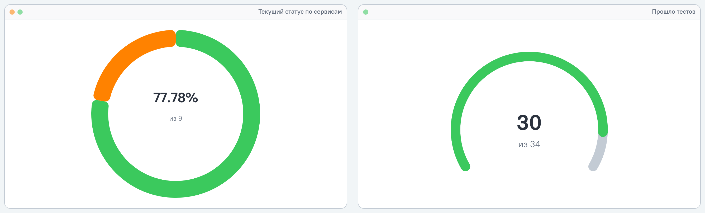

<table>
<tr>
<td width="50%" valign="top">

**Pyramid** (svg)

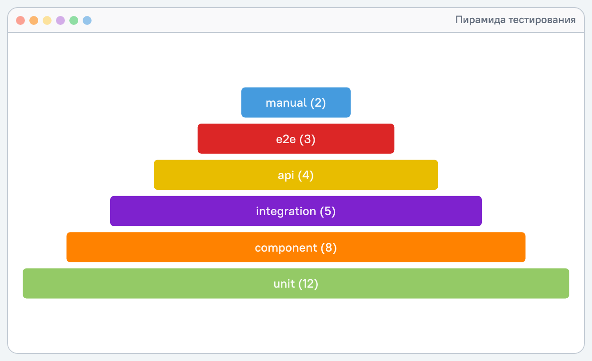

</td>
<td width="50%" valign="top">

**Gauge** (`panels.fromRun`, svg)

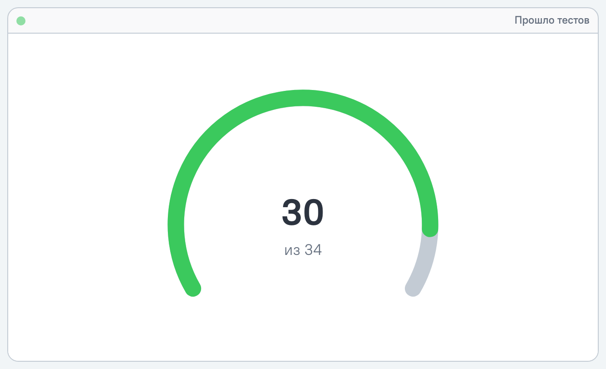

</td>
</tr>
<tr>
<td width="50%" valign="top">

**Table** (`panels.fromRun`, dom)

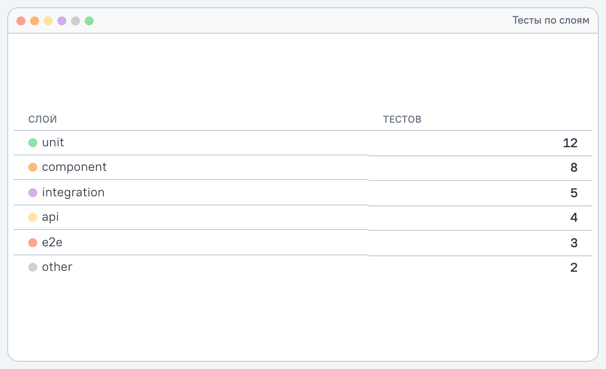

</td>
<td width="50%" valign="top">

**Flaky by layer** (highcharts bar)

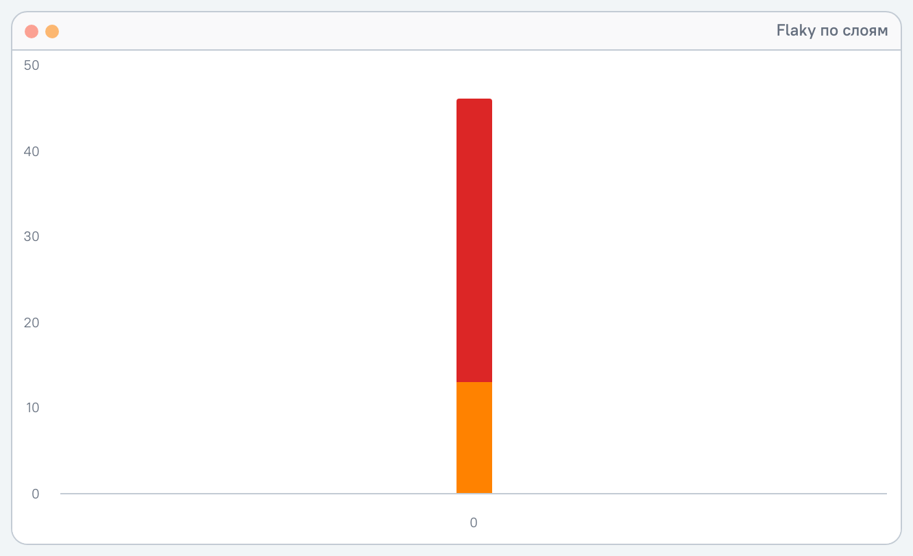

</td>
</tr>
</table>

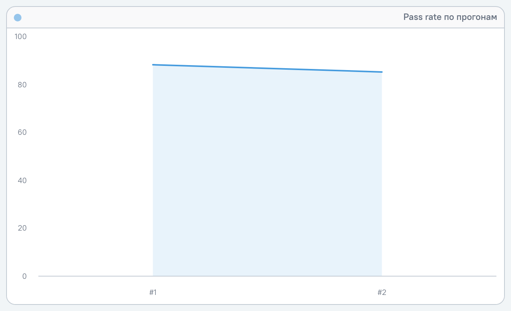

### Theme flip (same tile)

Chrome follows the host light/dark; chart palette stays on the kit canon.

<table>
<tr>
<td width="50%" valign="top">

**Light**

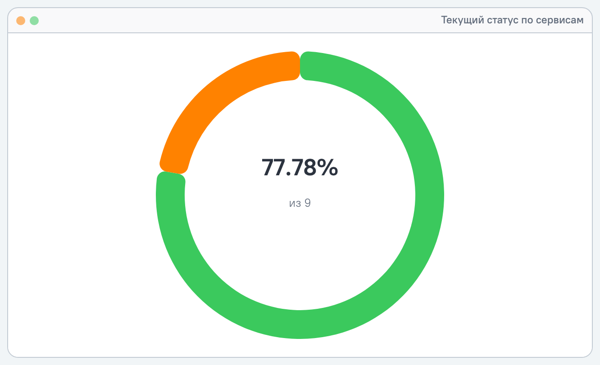

</td>
<td width="50%" valign="top">

**Dark**

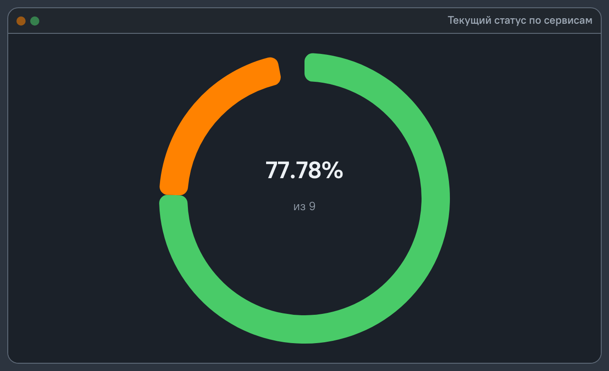

</td>
</tr>
</table>

### Multi-renderer (dogfood)

Same model, different backends — Highcharts pie next to the amCharts adapter
stub (`ark-dogfood`).

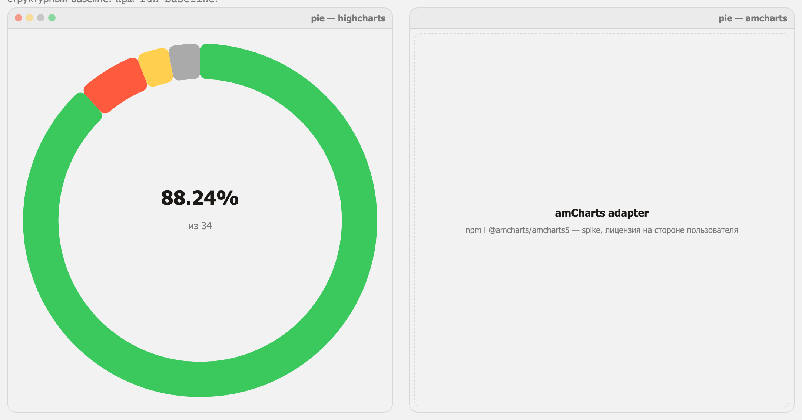

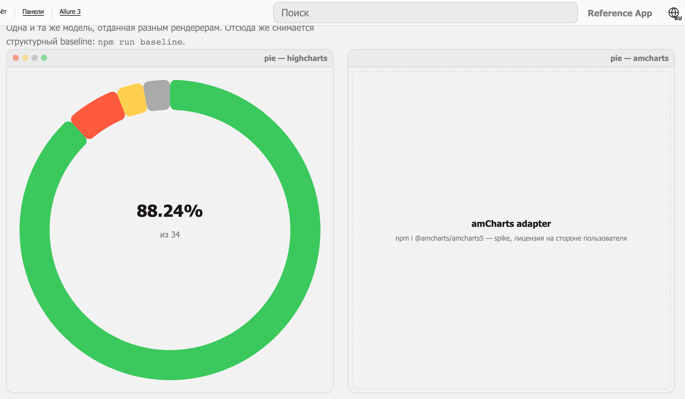

## Why

Stock Allure 3 lets you set a `logo` and a `light | dark | auto` theme. Anything
beyond that used to mean injecting CSS into hashed module classes
(`[class*="styles_grid__"]`) and post-processing rendered SVG. That breaks on
minor upgrades, cannot add a widget type, and cannot change how a single tile is
drawn.

The kit forks only the UI slice of Allure 3 and replaces the chart dispatch with
a renderer registry.

## Install

```bash
npm i -D @qa-guru/allure-report-kit
# pick the backends you actually use — all optional peers
npm i -D highcharts
```

## Usage

```js
import { withKit, charts, panels, presets, renderers, theme } from "@qa-guru/allure-report-kit";

export default withKit({
  name: "Reference App Tests",
  historyPath: "./history.jsonl",
  renderer: renderers.stock(),
  softFork: true,

  theme: theme.qaGuru({
    header: theme.header({ productName: "Reference App" }),
  }),

  qualityGate: {
    rules: [{ maxFailures: 10 }],
  },

  plugins: {
    awesome: {
      options: {
        charts: [
          ...presets.lockedQuad({ renderers: { durations: "highcharts" } }),
          panels.qualityGate({
            id: "allureQualityGate",
            title: "Allure Quality Gate",
          }),
          panels.custom({
            id: "servicesCurrentStatus",
            title: "Текущий статус по сервисам",
            renderer: "highcharts",
            dots: "fromSeries",
          }),
          charts.testResultSeverities({ renderer: "stock" }),
        ],
      },
    },
  },
});
```

Full example: `examples/minimal/allurerc.mjs`. E2e with Allure **and** Sonar QG:
`e2e/allurerc.mjs`.

## API

| Export | Purpose |
|--------|---------|
| `withKit(config)` | Wraps an Allure 3 config: resolves renderers, writes the `options.kit` manifest, reports diagnostics |
| `charts.*` | Typed builders for all 13 upstream chart types |
| `panels.custom / donut / bar / line / pyramid / gauge / table / qualityGate` | Kit-owned widget types |
| `panels.fromRun` / `panels.fromHistory` | Panel whose data the plugin computes from the run / history |
| `theme.qaGuru / tokensOnly / header` | Token sets and the report header |
| `renderers.stock / nivo / highcharts / amcharts / svg / dom` | Renderer specs (inert data) |
| `presets.lockedQuad / isLockedQuad` | The ADR 006 first screen |
| `@qa-guru/allure-report-kit/runtime` | Browser side: `createKitRuntime`, tile shell, QG/Sonar render, `mountReportHeader` |

## Renderers

| id | Backend | Draws | Notes |
|----|---------|-------|-------|
| `stock` (alias `nivo`) | Allure's own widget | everything | **page default**, upstream draws it |
| `highcharts` | Highcharts | pie, bar, line | commercial licence is yours to hold |
| `amcharts` | amcharts 5 | pie | adapter + placeholder; needs bundling, draws a stub otherwise |
| `svg` | none | pyramid, gauge | kit canon |
| `dom` | none | table, qualityGate | kit canon; no chart library draws rows |

Rules: a page may mix renderers freely, **one tile is drawn by exactly one
renderer**, and a backend that cannot draw a given kind never claims the tile —
inside a report it stays on Allure's own widget.

Models are backend-agnostic, one branch per **data shape** rather than per
(chart type × library) pair, which is what covers all 13 upstream chart types
without a combinatorial explosion of adapters.

Adding a backend means implementing one interface — chart models are
backend-agnostic, so there is no per-(chart × library) adapter:

```ts
import { createKitRuntime } from "@qa-guru/allure-report-kit/runtime";

const runtime = createKitRuntime({
  renderers: [
    {
      id: "plotly",
      supports: (model) => model.kind === "bar",
      render: async ({ host, model, resolveLib }) => {
        const plotly = await resolveLib("plotly");
        /* draw */
        return { families: ["green"], renderedBy: "plotly" };
      },
    },
  ],
});
```

## Custom panels and indicators

A panel is a first-class tile, not a decorated stock widget. Its shell is the
design-system `widget-tile`: `__bar` (indicators + title) and `__body` (chart).

`dots` decides what appears in the bar:

| Value | Result |
|-------|--------|
| `"fromSeries"` (default) | only the status families really drawn |
| `["red", "green"]` | that fixed set |
| `false` | no indicator row at all |

"Really drawn" is checked against the paint, not just the model: after rendering,
a family whose colour is nowhere in the tile's data marks — an all-zero stacked
series, a slice the library dropped — loses its dot. A family may also come from
a single **point** rather than a series, which is how `stabilityDistribution`
shows one bar per group coloured by its own threshold.

Families always render in one order: red, orange, yellow, purple, gray, green,
blue. These are **not** the three macOS traffic-lights of the design-system
`panel__dots` — a different primitive.

Stock Allure 3 skips unknown chart types (`generateChartData` ends in
`default: break`), so a config with panels still loads without the fork — the
panel simply does not appear, and `withKit` says so.

### Quality gate panels

`panels.qualityGate()` evaluates `qualityGate.rules` against the run (same path
as Allure's gate widget, shaped for the DS primitive). Sonar uses the same tile
shell with `kind: "sonar"` data (see `e2e/allurerc.mjs`). Inside a
`widget-tile`, the gate is flush content — one chrome, bar inset matches
neighbouring tiles (`--wt-bar-inset`).

### Panels from the run

A panel does not have to carry its data in the config. `panels.fromRun` names a
grouping, and the plugin resolves it against the store at generation time and
ships the result as a report widget — so the panel follows the run the way a
stock chart does, and nothing about it is inlined into `index.html`.

```js
panels.fromRun({
  id: "layersTable",
  title: "Тесты по слоям",
  groupBy: "layer",        // status | layer | severity | label:<name>
  metric: "count",         // count | passRate | duration
  kind: "table",
  columns: ["Слой", "Тестов"],
  limit: 5,                // the tail folds into `other`
});
```

`groupBy: "status"` and `"layer"` colour their groups from the locked canon, so
the bar indicators keep working; any other grouping falls back to the theme's
series ramp. This one needs the soft-fork — an upstream plugin has nothing to
compute it with, and `withKit` says so.

A panel can also point at a widget you write yourself with `dataUrl`.

## Locked 2×2

`presets.lockedQuad()` emits the first-screen invariant of the monorepo
(ADR 006) and nothing else:

```
[0] currentStatus (pie)   [1] durationDynamics
[2] testingPyramid        [3] durations (groupBy: layer)
```

Renderers are free, the order is not. Validation belongs to the monorepo:

```bash
node generators/ethalon/tests-java/scripts/validate-allurerc.mjs \
  projects/allure-report-kit-home/allure-report-kit/examples/minimal/allurerc.mjs
```

## `theme.header`

`theme.header` mounts the design-system header above the report — the shared
primitive, not a copy of a consumer app's header. The report is pushed down by
the band's *measured* height, so Allure's own section switcher stays reachable.

The theme is mirrored **both ways** (`html.theme-light` ↔ `html[data-theme]`),
so the two switches — the header's and Allure's own — never disagree, and the
header's icon follows a change it did not initiate.

Not supported with `singleFile: true` — the plugin falls back to stock Allure
and says so.

The design-system stays the source of truth; the pinned copy under
`src/theme/vendor/design-system/` is refreshed mechanically:

```bash
npm run sync:ds           # update from the monorepo design-system
npm run sync:ds -- --check  # CI: fail when the copy is stale
```

## Theme and the host

The kit theme owns the **chart palette** — status and layer colours are a locked
canon. The **chrome** (surfaces, text, borders) belongs to the host: `kit.css`
declares it in a cascade layer that resolves to Allure's own tokens, so a tile
follows the report's light/dark instead of repainting it. Standalone pages add
the design-system layer back with `@qa-guru/allure-report-kit/theme/standalone.css`.

Canvas backends read CSS custom properties once, at draw time, so
`runtime.observeTheme()` redraws tiles when the theme flips.

## Development

Fresh clone:

```bash
npm run setup          # installs and builds every package in dependency order
```

The packages are linked with `file:` rather than an npm workspace root, because
each forked bundle carries its own large upstream tree — so install order
matters and `setup` owns it.

```bash
npm run build          # tsc → dist/
npm test               # node --test
npm run sync:ds        # refresh vendored design-system primitives
npm run verify         # build + unit tests + dogfood smoke

npm run build:fork     # webpack → packages/web-{awesome,dashboard}/dist
npm run typecheck:fork # type-check the fork delta (see soft-fork/README.md)
npm run verify:report  # build + forks + real reports + report smoke
npm run smoke:ci       # both smokes on servers the script owns (no stands)
```

Two levels of proof:

| | What it proves | Stand |
|---|---|---|
| `dogfood/` | renderers, panels, indicators, DS header — standalone | `ensure.py ark-dogfood` → :3021 |
| `e2e/` | the soft-fork inside generated Awesome **and** Dashboard reports | `ensure.py ark-report` → :3024 |

`e2e/` builds its own deterministic fixture (18 tests over six layers, three runs
so history exists), so it depends on nobody's build output.

## Licences

The kit is Apache-2.0 and **ships no chart library code**. Every backend is an
optional peer dependency; the plugin copies the UMD build of the ones your config
actually uses out of your own `node_modules` into the report. A report that does
not use Highcharts does not carry Highcharts, and the kit never redistributes a
proprietary bundle.

| Library | Licence | What it means for you |
|---------|---------|-----------------------|
| Highcharts | proprietary, free for non-commercial use | a commercial user holds their own licence |
| amCharts 5 | proprietary, free with attribution | the attribution link is required in free mode |
| nivo | MIT | arrives transitively with Allure, draws the `stock` tiles |

No licence key or licence file belongs in this repository. This table is the
counterpart of ADR 012 §6 in the monorepo — keep the two in step.
